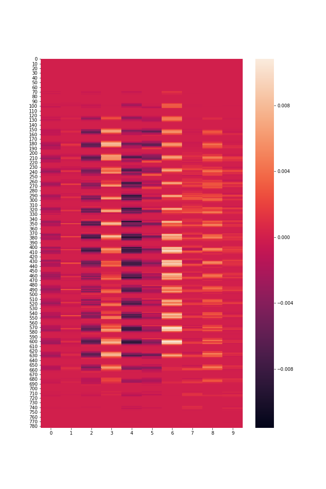

# Simple Binary Connect

*[A bare-bones instructional implementation of BinaryConnect.](https://nbviewer.jupyter.org/github/priyamtejaswin/simple-binary-connect/blob/master/tutorial.ipynb)*

A conversation at work spawned a discussion about the difficulties of successfully deploying Deep Neural Networks on embedded and mobile devices. A [very]rough review revealed three broad approaches:
- Training shallower/smaller architectures to reduce parameters.
- Pruning redundant network connections.
- Quantization of weights while preserving accuracy.

## What is this?

This repo is a tutorial. The focus of the tutorial is the [2015 BinaryConnect paper](https://arxiv.org/pdf/1511.00363), which falls in the third category. The paper proposes a training procedure to learn binarized weights (+1, -1) as opposed to full precision weights (32bits or 64bits) with minimal loss in precision.
The content in the [tutorial.ipynb notebook](https://nbviewer.jupyter.org/github/priyamtejaswin/simple-binary-connect/blob/master/tutorial.ipynb) is organised as follows:

1. Introduction (this README file)
2. Objective
3. Some Theory
4. Forward Pass
5. Backward Pass
6. Testing
7. Adding Binarization
8. Testing Binarization
9. Discussion

## Does it work?

Well, yes. It does work... in the confines of what I had set out to do (which I explain in the **Objective** section). There are some points which I discuss in the end of the post after testing the binarization which I'm pasting below (***Section 8 and Section 9*** from the tutorial).

### 8. Testing Binarization

Here's a rough sketch of the algorithm:

1. Initalize weights `w` and  binarize them into a different variable `w_bin` . Use `w_bin` in the forward pass.
2. Calculate the error gradients. These will now be calculated w.r.t. `w_bin` and `b`.
3. Update and clip the full precision weights `w`.

```python
## Binarization algorithm.
np.random.seed(1234)
w = np.random.rand(nfeats, nclasses)
b = np.ones((1, nclasses))
alpha = 0.5
changes = 0

print "\n\tWITH BINARIZATION\n"
print "Index, TestLoss, TestAcc\n"
prev_loss = 0
for ix in range(10000):
    x, t = mnist.train.next_batch(batch_size=batch_size)
    w_bin = binarize(w) ## Step1 - Binarize before forward pass.

    logits = logistic_model(x, w_bin, b) ## Step2 - Forward pass with binarized weights.
    loss = ce_loss(logits, t)

    grads = gradients(logits, t, x) ## Step3a - Gradients against the binarized weights.
    w, b = update_params((w, b), grads, alpha)
    w = clip(w) ## Step3b - Clip.

    if (ix+1)%200 == 0:
        test_logits = logistic_model(mnist.test.images, w_bin, b) ## Use binarized weights.
        test_acc = np.mean(np.argmax(test_logits, axis=1) == np.argmax(mnist.test.labels, axis=1))
        test_loss = ce_loss(test_logits, mnist.test.labels)

        print ix+1, test_loss, test_acc

        if prev_loss<test_loss:
            alpha = alpha * 0.9 ## Decay.
            changes += 1
            print "Updating alpha. Changes at", changes

        prev_loss = test_loss

    if changes>4:
        print "Exiting."
        print "Last test loss:", test_loss
        print "Last test accuracy:", test_acc
        break
## END ##
```

Running the algorithm gives the following results:

```python
	WITH BINARIZATION

Index, TestLoss, TestAcc

200 0.8735591990334786 0.7882
Updating alpha. Changes at 1
400 1.3220157012354152 0.7674
Updating alpha. Changes at 2
600 0.9633363888298269 0.8377
800 0.903804915904683 0.8288
1000 1.2096846063292197 0.8118
Updating alpha. Changes at 3
1200 1.5352151377310235 0.799
Updating alpha. Changes at 4
1400 0.861254799516688 0.8705
1600 0.9397290421057929 0.8519
Updating alpha. Changes at 5
Exiting.
Last test loss: 0.9397290421057929
Last test accuracy: 0.8519
```

Hooray! It's working!


### 9. Discussion.

Well. It works. But the paper leaves some unanswered questions:

1. Why weren't the biases binarized?
2. Why is the training so jittery?
3. What if I just binarize the final weights after the normal training?

Let's try to answer the easiest questions first.

#### What if I just binarize the final weights after the normal training?

The original test_loss and test_acc were 0.43 and 0.8716. If I were to binarize these learned weights and evaluate, I get an accuracy of 0.5918. So yeah, the authors are clearly onto something.


#### Why weren't the biases binarized?

This one is strange. Since the bias was just there, I tried binarizing it along the lines of the weights. Without bias binarization, we see a accuracy of 0.8571 . With bias binarization, we see 0.8129 . So, you can go ahead an binarize the biases. And while there is a drop in the accuracy, I would not put a lot of trust on this because of the first unanswered question.


#### Why is the training so jittery?

The update procedure was so unstable that I had to add a decay factor to the training rate and stop training if the accuracy keeps decreasing.  One reason could be becuase I'm not using Adam.

Another reason could be that the pameters and the updates oscillate around 0, which is why even between consecutive epochs, there is a huge drop in accuracy - because even though the parameter update was small, it crossed over to the other side of 0 and that changed a lot of binarized weights.

To veryfy this, I tracked the weights and biases at every step. I noticed that between step 97 and 98, the accuracy drop from 0.60 to 0.55 . The l1norm between the two epoch weights is just 7.68 . That's the difference between 7840 values. Plotting a heat map of the difference might shows that the changes were very close to 0. Alltogether, there were 31 flips in the signs, meaning that for 31 inputs, the signal just reveresed, and that might have contributed to the drastic drop in accuracy.




## Where's the code?

The code for the tutorial is in `scratch.ipynb`. You can refer to the complete post at https://nbviewer.jupyter.org/github/priyamtejaswin/simple-binary-connect/blob/master/tutorial.ipynb    I highly recommend that you view it on through the link or fire up a Jupyter server and then view it on your local system - it has a lot of Mathjax and the Github rendering is just awful.

## What do I need to run this?

```
numpy==1.14.0
matplotlib==2.1.0
seaborn==0.8
tensorflow==1.5.0 # (Only for MNIST data download and loading!)
```
`tensorflow` is only required for downloading and prepping the MNIST data. It contains 55,000 training and 10,000 testing samples with utilities for iterating over the data in batches. It will save you a lot time.

Thanks!
